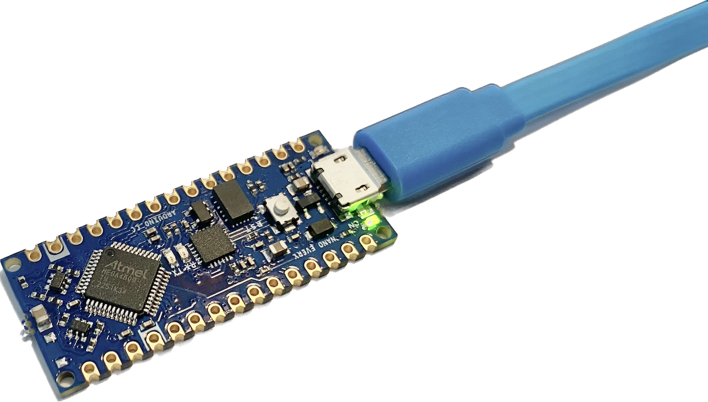
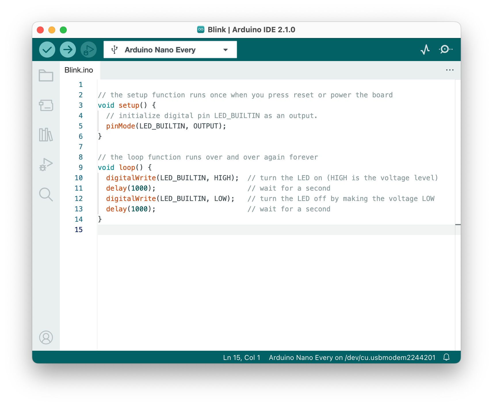
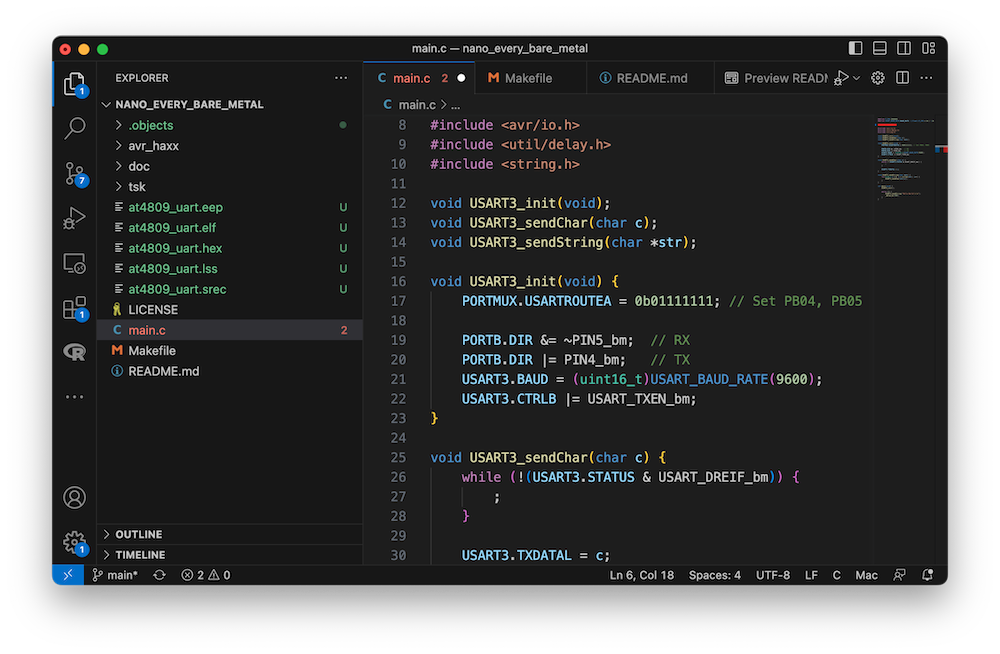
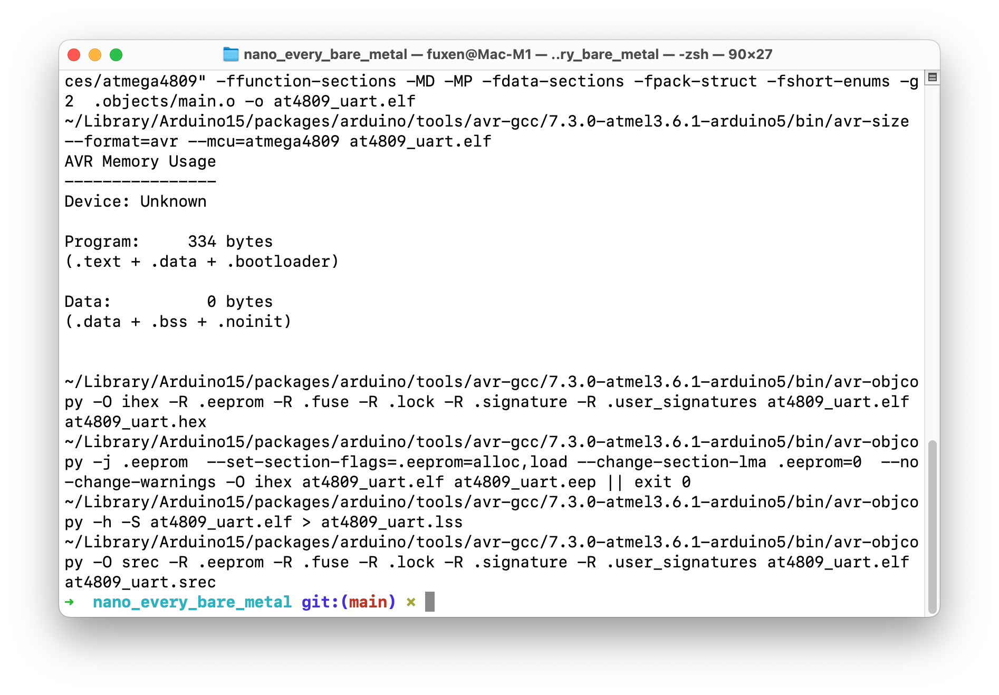
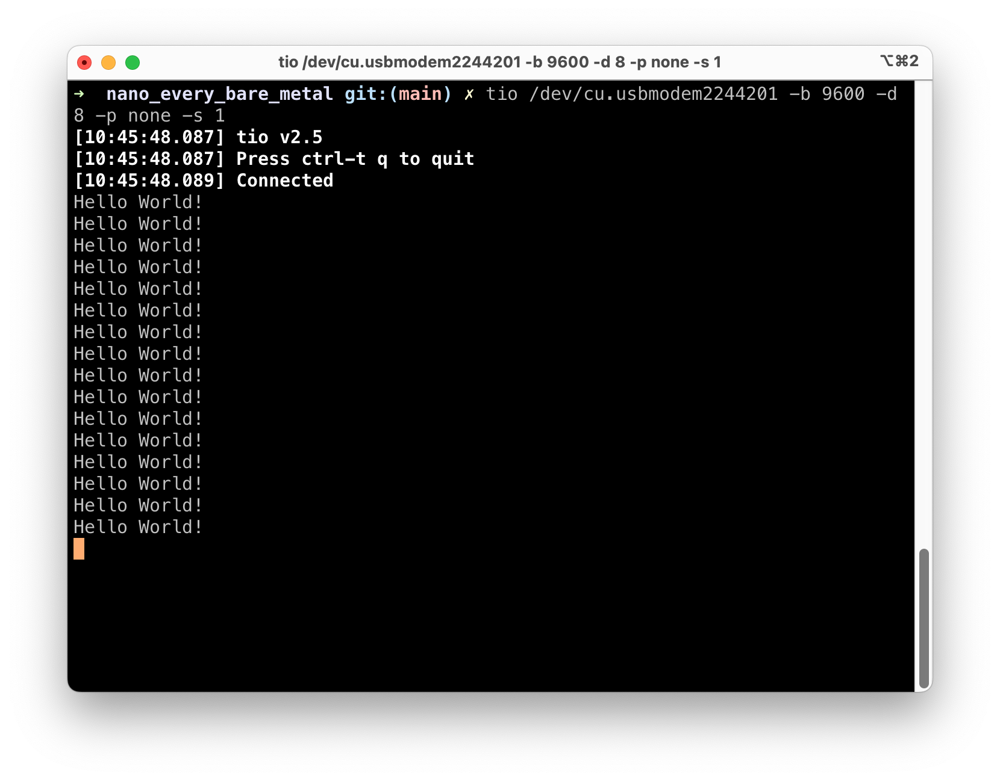

# Bare metal C-development on the Arduino Nano Every board
	By Hans-Henrik Fuxelius, 2023-04-27

## Introduction
The [Arduino Nano Every](https://store.arduino.cc/products/arduino-nano-every) board is equipped with the ATmega4809 microcontroller that came to market in 2018. It is a modern replacement of the 20 year old ATmega328p with being better in almost everything save EEPROM that is just a quarter of the previous. It has an 8-bit AVR processor developed by Microchip/Atmel that can run up to 20MHz on an internal clock crystal. It comes with 6KB of SRAM, 48KB of flash, and 256 bytes of EEPROM. The chip features the latest technologies like flexible and efficient-power architecture, including Event System and Sleepwalking, precious analog features, and advanced peripherals.

The Arduino Nano Every differentiate itself somewhat from other Arduino boards with an Atmel processor. Usually an bootloader is present in EEPROM for uploading software to the microcontroller. The Nano Every does not use an bootloader but is programmed directly by the Unified Program and Debug Interface (UDPI) protocol. The  UPDI is a Microchip proprietary interface for external programming and on-chip debugging of a device. This programming can be done directly with harware tools ([Atmel-ICE Debugger](https://onlinedocs.microchip.com/pr/GUID-DDB0017E-84E3-4E77-AAE9-7AC4290E5E8B-en-US-4/index.html?GUID-9B349315-2842-4189-B88C-49F4E1055D7F)) or by software ([jtag2udpi](https://github.com/ElTangas/jtag2updi#)) in an embedded processor. In this case the ATSAMD11D14A ARM Cortex M0+ processor acts as a bridge between USB and the main ATmega4809 microcontroller. The upside of not using a bootloader is obvious. You have the entire memory space for your own project and can also develop your own bootloaders without have to worry about bricking it. UDPI is also much quicker than using a bootloader, usually just a few seconds. In this sense I personally think the **Nano Every is the coolest and most versatile** of the entire lineup of Arduino AVR development boards. For a very cheap price you get both the development board and a USB cable that has very few drawbacks and no extra cost added in the future, as often is the case in embedded development as you might find out ;)

## Arduini IDE
Arduino is designed to make the microcontroller world more accessible to students and beginners. The [Arduino IDE](https://www.arduino.cc/en/software) is excellent to get you started in embedded programming. The excellent  thing with the Arduino hardware is that it is absolutely general and not locked down to or limited to use only with the Arduino IDE. The Arduino version of C++ is adapted to work with many different processors and different architechtures. In some sense the least common denominator governs how and what can be done within the framework. To unleash the full potential of the ATmega4809 you need to use its native libraries and do programming in standard C.

## Bare Metal Development
If you develop in Windows it is easy to get started with [Microchip Studio](https://www.microchip.com/en-us/tools-resources/develop/microchip-studio) which is free of cost and a very nice environment to work in. With that said. However. If you, like me, are used to work in an UNIX environment the locked in Windows environment feels a bit narrow at times, especially if you are used to do development and programming on Ubuntu or MacOS. In industry Windows is standard but for many students and researchers at university are more used to Apple laptops and desktops.

For those of us who are used to develop with standard C (C99) in UNIX for Apple Silicon, Ubuntu or Fedora and want to get started there are fewer alternatives than in Windows that is standard for electronics and microcontroller development.

We are going to set up our environment to use [Visual Studio Code](https://code.visualstudio.com/download) as editor instead of Arduino IDE or Microchip Studio. It is superior for software development when code is running big and for working in shared project over GitHub. 

Compiling and uploading the c-code to the board takes place in **Bash** by calling a Makefile with the **make** command:

	make         # Compiles the C-program
	make flash   # Flash the program to the controller

To connect to the board a serial interface is needed. We are going to use [tio](https://github.com/tio/tio) for this which is a simple serial device tool which features a straightforward command-line and configuration file interface to easily connect to serial TTY devices for basic I/O operations. To make a simpler serial device tool for talking with serial TTY devices with less focus on classic terminal/modem features and more focus on the needs of embedded developers and hackers.

## Installation and Configuration
Do the following steps to install a system as above.

### 1) Arduino IDE
Download the latest [Arduino IDE](https://docs.arduino.cc/software/ide-v2) and install it if you have not already done that. We are going to use its avr-gcc compiler and tools for compiling. 

Homebrew

## References and Further Resources

https://makefiletutorial.com

https://raw.githubusercontent.com/tio/tio/master/man/tio.1.txt