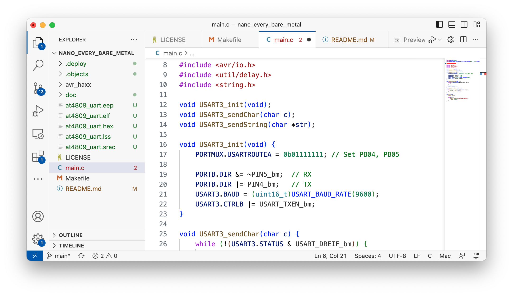
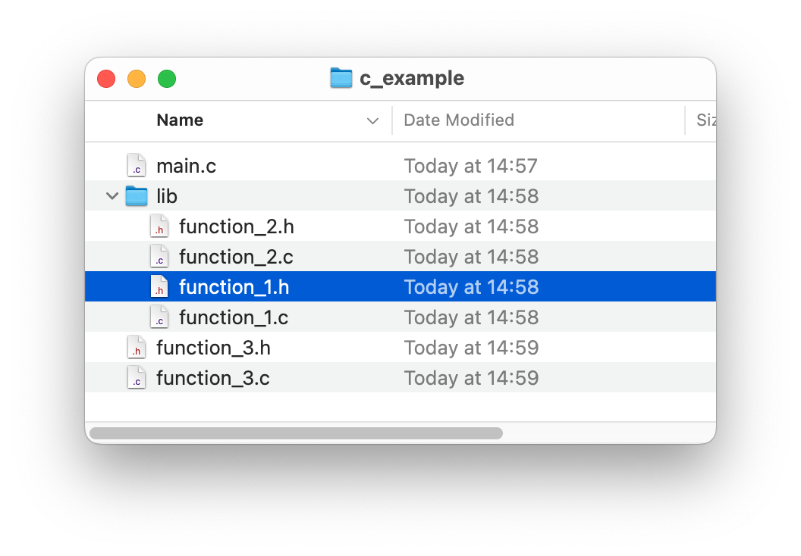

# Develop Like a Pro on the 'Arduino Nano Every'-Board with MacOS
	
**``By Hans-Henrik Fuxelius, 2023-04-27``

## Introduction

Have you been tinkering around with these cheap and accesible Arduino-boards for a while, and felt like. Hmm whats the next step up the ladder? A first step could be to set up a productive environment for C development! This short introduction is **made to be followed** with the [Arduino Nano Every](https://store.arduino.cc/products/arduino-nano-every) board on MacOS, but once the ``Makefile`` is clearly understood you could readily, with some effort, adapt it to any microcontroller from the AVR family (tinyAVR, megaAVR, XMEGA, ...) and also to Ubunto or Fedora.

The Arduino Nano Every board is equipped with the [ATmega4809 microcontroller](https://www.microchip.com/en-us/product/ATMEGA4809) (The [megaAVR® 0-Series](http://ww1.microchip.com/downloads/en/DeviceDoc/megaAVR0-series-Family-Data-Sheet-DS40002015B.pdf), which also includes ATmega808, ATmega809, ATmega1608, ATmega1609, ATmega3208, ATmega3209 and ATmega4808) that came to market in 2019. It is a modern replacement of the 20 year old ATmega328p with being better in almost every regard save EEPROM that is just a quarter of the previous. It has an 8-bit AVR processor developed by Microchip/Atmel that can run up to 20MHz on an internal clock crystal. It comes with 6KB of SRAM, 48KB of flash, and 256 bytes of EEPROM. The chip features the latest technologies like flexible and efficient-power architecture, including Event System and Sleepwalking, precious analog features, and advanced peripherals.

The Arduino Nano Every differentiate itself somewhat from other Arduino boards with an Atmel processor. Usually a bootloader is present in Flash memory for uploading software to the microcontroller. The Nano Every does not use an bootloader but is programmed directly by the Unified Program and Debug Interface (UDPI) protocol. The  UPDI is a Microchip proprietary interface for external programming and on-chip debugging of a device. This programming can be done directly with harware tools like the [Atmel-ICE Debugger](https://onlinedocs.microchip.com/pr/GUID-DDB0017E-84E3-4E77-AAE9-7AC4290E5E8B-en-US-4/index.html?GUID-9B349315-2842-4189-B88C-49F4E1055D7F) or by software [jtag2udpi](https://github.com/ElTangas/jtag2updi#) in an embedded processor. In this case the ATSAMD11D14A ARM Cortex M0+ processor acts as a bridge between USB and the main ATmega4809 microcontroller. The upside of not using a bootloader is obvious. You have the entire memory space for your own project and can also develop your own bootloaders without have to worry about bricking it. UDPI is also much quicker than using a bootloader, usually just a few seconds. In this sense I personally think the **Nano Every is the coolest and most versatile** of the entire lineup of Arduino AVR development boards. For a very cheap price you get both the development board and a USB cable that has very few drawbacks and at no extra cost added in the future, as often is the case in embedded development as you might find out ;)

The description here is general enought for pro development in C for all the AVR microcontrollers on the MacOS, like:

## Arduino IDE
Arduino is designed to make the microcontroller world more accessible to students and beginners. The [Arduino IDE](https://www.arduino.cc/en/software) is excellent to get you started in embedded programming. The excellent  thing with the Arduino hardware is that it is absolutely general and not locked down to or limited to use only with the Arduino IDE. The Arduino version of C++ is adapted to work with many different processors and different architechtures. In some sense the least common denominator governs how and what can be done within the framework. To unleash the full potential of the ATmega4809 you need to use its native libraries and do programming in standard C.

## Bare Metal Development
If you develop in Windows it is easy to get started with [Microchip Studio](https://www.microchip.com/en-us/tools-resources/develop/microchip-studio) which is free of cost and a very nice environment to work in. With that said. However. If you, like me, are used to work in an UNIX environment the locked in Windows environment feels a bit narrow at times, especially if you are used to do development and programming on Ubuntu or MacOS. In industry Windows is standard but for many students and researchers at university are more used to Apple laptops and desktops.

For those of us who are used to develop with standard C (C99) in UNIX for Apple Silicon, Ubuntu or Fedora and want to get started there are fewer alternatives than in Windows that is standard for electronics and microcontroller development.

We are going to set up our environment to use [Visual Studio Code](https://code.visualstudio.com/download) as editor instead of Arduino IDE or Microchip Studio. It is superior for software development when code is running big and for working in shared project over GitHub. 

Compiling and uploading the c-code to the board takes place in *Bash* by calling a ``Makefile`` with the ``make`` command:

	make         # Compiles the C-program
	make flash   # Flash the program to the controller
	make serial  # Starts the serial monitor to the controller

To connect to the board a serial interface is needed. We are going to use [tio](https://github.com/tio/tio) for this which is a simple serial device tool which features a straightforward command-line and configuration file interface to easily connect to serial TTY devices for basic I/O operations. To make a simpler serial device tool for talking with serial TTY devices with less focus on classic terminal/modem features and more focus on the needs of embedded developers and hackers.

## Installation, Configuration and Test
### Follow these steps to install a complete system:

### 1) Arduino IDE

Download the latest [Arduino IDE](https://docs.arduino.cc/software/ide-v2) and install it if you have not already done so. We are going to use only its [avr toolchain](https://github.com/arduino/toolchain-avr) as **avr-gcc** compiler and other tools. 

### 2) Homebrew
You need to install [Homebrew](https://mac.install.guide/homebrew/index.html) in order to install a few crucial components to get the environment functional.

Once Homebrew is installed, install the following programs.

	brew install make
	brew install tio
	brew install avrdude
	
### 3) Install source
Install the source code from my GitHub page

	git clone git@github.com:fuxelius/nano_every_bare_metal.git
	cd nano_every_bare_metal

### 4) Visual Studio Code
Install [Visual Studio Code](https://code.visualstudio.com/download) and open the ``nano_every_bare_metal`` directory form inside VS Code menu ``Open Folder...``.
	
### 5) Set path to avr-gcc toolchain in Arduino Library
Find out the right path to your avr-gcc binaries, and edit this path in ``Makefile``

	TOOLCHAIN_PATH = ~/Library/Arduino15/packages/arduino/tools/avr-gcc/7.3.0-atmel3.6.1-arduino5/bin
	
### 6) Test if it works

Try out this test sequence:

	make          # Compile code
	make flash    # Upload hex image
	make serial   # Connect serial to board
		
The last ``make serial`` should show scrolling lines with ``Hello world!``

If it scrolls it means **everything is working** and its all a go!
		
Quit serial with ``CTRL+T Q``
	
## C Development

Now that the environment is up and functional, we should take a look at how C-development takes place.

### Separate Compilation
The ``Makefile`` is set up for [separate compilation](https://users.cs.utah.edu/~zachary/isp/tutorials/separate/separate.html) which make for fast compile and linking. It will recurse through all folders  of any depth and compile and link them. 

All temporary object files are placed in the ``./object`` folder to make the source-code folder less littered with temporary code. If you want the object-code just traverse the ``./object`` folder. 

You only have to add the header files to ``main.c`` with path and the linker resolves the rest for you.

1.  Edit your C-code

2.  Type ``make`` to separate compile the project code within the folder just . This compiles all C-code and C-headers to object code and put it in the ``./object`` folder. In the same step it links it to an executable ELF file and produce the HEX image for it with the name given in the ``Makefile`` labeled ``TARGET``. 

3.  Type ``make flash`` to upload the HEX image to the microcontroller. 

4.  Type ``make serial`` to connect to the UART and let you communicate with it in text.

5. GOTO 1.

Type ``make clean`` to remove temporary object code and compiled files.

Type ``make fuse`` to set the fuses, labeled ``FUSES`` in the ``Makefile``

Type ``make install`` to compile and set fuses at the same time.

Type ``make deploy`` to create an MD5-typed image with timestamp in the ``./deploy`` folder

### AVR-GCC Compiler and Libc library

Most fundamental for developing in ``C`` for the AVR microcontrollera are the [avr-gcc](https://gcc.gnu.org/wiki/avr-gcc) compiler and the [AVR Libc](https://www.nongnu.org/avr-libc/user-manual/group__avr__pgmspace.html) library and the [AVR Libc 2.1.0 Manual](doc/avr-libc-user-manual-2.1.0.pdf). Having the [avr-gcc compiler flags](doc/avr-gcc compiler flags.html) is also necessary. 

When you read the [datasheet](doc/ATmega4808-09-DataSheet-DS40002173C.pdf) for the atmega4809 microcontroller it is handy to look at its [header file](doc/iom4809.h) for naming registers and ports in c-code so it comply with standard development on AVR platform.

### Image Deployment
Once a HEX image is ready for the test phase it should go into deployment. 

	make deploy

In the ``./deploy`` directory you find the hex-image with its [MD5](https://en.wikipedia.org/wiki/MD5#:~:text=The%20MD5%20message%2Ddigest%20algorithm,MD5) checksum so it can be verified in the future to be a valid image without corrupted bits or bytes. 	

	.deploy/at4809_uart_20230427_192235.hex 
	.deploy/at4809_uart_20230427_192235.md5
	
	
Not knowing which image is the correct one and go into production can make it or break it. Always know which image you are testing and using for production.

## Some C Books

The [C Programming Language](https://www.amazon.com/Programming-Language-2nd-Brian-Kernighan/dp/0131103628) (sometimes termed K&R, after its authors' initials) is a computer programming book written by Brian Kernighan and Dennis Ritchie, the latter of whom originally designed and implemented the language, as well as co-designed the Unix operating system with which development of the language was closely intertwined. The book was central to the development and popularization of the C programming language and is still widely read and used today. Because the book was co-authored by the original language designer, and because the first edition of the book served for many years as the de facto standard for the language, the book was regarded by many to be the authoritative reference on C

[Modern C](https://www.amazon.se/Modern-C-Jens-Gustedt/dp/1617295817)

[Algorithms With C](https://www.amazon.se/Mastering-Algorithms-C-Kyle-Loudon/dp/1565924533/ref=sr_1_9?crid=ZTTNRRAL9B08&keywords=algorithms+with+c&qid=1682612292&sprefix=algorithms+with+c%2Caps%2C159&sr=8-9)

## Makefile internals

TARGET: the name of the project, resulting name is TARGET.hex. Change it to a proper name for your project

CLOCK: The fuses are set to 16MHz and default for 4809 is to divide by 6 that gives 2666666

FUSES: These are given in the [datasheet](doc/ATmega4808-09-DataSheet-DS40002173C.pdf)

DEVICE: You can get the proper name to support other AVR MCUs than 4809 in [Microchip Packs Repository](https://packs.download.atmel.com)

PARTNO that goes into the [avrdude](https://github.com/avrdudes/avrdude#) command line comes from the list of supported AVR microcontrollers in the avrdude [manual](https://avrdudes.github.io/avrdude/) . Here you can find all supported devices. So m4809 is a short for ATmega4809. If you want to use another microcontroller, just look it up in the list.

Unless you get DEVICE and PARTNO right it will not compile and upload correctly, it is bad at guessing.

TOOLCHAIN\_PATH: This refers into the library directory of the Arduino distribution, ~/Library/Arduino15/packages/arduino/tools/avr-gcc/7.3.0-atmel3.6.1-arduino5/bin. A problem with this is that it can change if a new Arduino IDE installation takes place and removes the old one. A remedy to this is to copy the AVR toolchain out of Arduino IDE to a safe place like:

	cp ~/Library/Arduino15/packages/arduino/tools/avr-gcc/7.3.0-atmel3.6.1-arduino5/bin \
	    /Volumes/Sky/AVR/avr-toolchain/

AVR\_HAXX\_PATH: This should not really reside in the same folder as the code, but shold be moved to the same folder as TOOLCHAIN\_PATH resides in, so:

	mv avr_haxx /Volumes/Sky/AVR/avr_haxx

Now AVR tools resides locally:

	/Volumes/Sky/AVR/avr-toolchain/...
	/Volumes/Sky/AVR/avr_haxx/..
	
The updated paths in the ``Makefile`` should look like:

	TOOLCHAIN_PATH  = /Volumes/Sky/AVR/avr-toolchain/bin
	AVR_HAXX_PATH   = /Volumes/Sky/AVR-GCC/avr_haxx	
	
The C-project folders now only need the ``Makefile`` and C-code to compile and flash.

To understand and further develop the ``Makefile`` you need to learn how [makefiles](https://makefiletutorial.com) work. It is a bit tricky for young players, but once you got the hang of it, its really makes the day!

## Support of Other AVR Microcontrollers

[Microchip Packs Repository](https://packs.download.atmel.com)

[Toolchains for AVR Microcontrollers](https://www.microchip.com/en-us/tools-resources/develop/microchip-studio/gcc-compilers)

[Microchip.ATmega_DFP.3.0.158.atpack](http://packs.download.atmel.com)

Microchip does not make it easy. Instead of them simply providing a full avr-libc to build, we have to hack things together. Hopefully "upstream" avr-libc will soon support tinyAVR 1-series (like attiny1614), and this could be skipped.

Get Atmel/Microchip ATtiny_DFP Pack (try http://packs.download.atmel.com/) It is called something like "Atmel.ATtiny_DFP.1.3.229.atpack". It's really just a zip archive with .atpack extention.

Unpack and enter into directory, then we must copy the following 3 files from Atmel pack:

	gcc/dev/attiny1614/avrxmega3/libattiny1614.a,
	gcc/dev/attiny1614/avrxmega3/crtattiny1614.o,
	include/avr/iotn1614.h:

Supporting Other AVR Microcontrollers

The avr_haxx has files to support for the entire [megaAVR® 0-Series](http://ww1.microchip.com/downloads/en/DeviceDoc/megaAVR0-series-Family-Data-Sheet-DS40002015B.pdf) of microcontrollers:
 	
 	ATmega808
	ATmega1608
	ATmega1609
	ATmega3208
	ATmega3209 
	ATmega4808
	ATmega4809

To add support for other microcontrolles get them from atmel packs

descibe file structure and separate compilation, the .deploy and .object directory

## Arduino Nano Every Pinout

## References and Further Resources

Tom Almy has a written an excellent book ([Far Inside The Arduino: Nano Every Supplement](https://www.amazon.com/Far-Inside-Arduino-Every-Supplement/dp/B08GFL6VBF/ref=sr_1_1?crid=1ATDVO5JQV8GI&keywords=Far+Inside+The+Arduino%3A+Nano+Every+Supplement&qid=1682675028&sprefix=far+inside+the+arduino+nano+every+supplement%2Caps%2C202&sr=8-1)) on the internals of the Nano Every board and have a [homepage](https://tomalmy.com/category/arduino-nano-every/) that is updated regularly on the Arduino Nano Every board and software projects conneted to it. He has some interesting blog posts about [FreeRTOS](https://www.freertos.org/microchip-atmega-0-demo.html) on the ATmega4809 (Arduino Nano Every)

[avrdude manual](https://github.com/avrdudes/avrdude#)

[avrdude](https://avrdudes.github.io/avrdude/)

https://tomalmy.com/category/arduino-nano-every/

https://www.freertos.org/microchip-atmega-0-demo.html

https://makefiletutorial.com

https://raw.githubusercontent.com/tio/tio/master/man/tio.1.txt