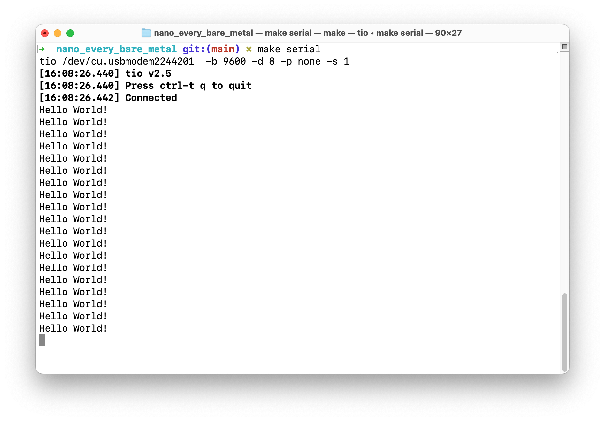

# Bare metal development on the Arduino Nano Every board
	By Hans-Henrik Fuxelius, 2023-04-27

The Arduino Nano Every board is equipped with the ATmega4809 microcontroller that came to market in 2018. It supersede the 20 year old ATmega328p with being better in almost everything save EEPROM that is just a quarter of the previous.

For us who is used to develop in standard C (C99) on UNIX on Apple Silicon, Ubuntu or Fedora and want to get started there are fewer alternatives than in Windows that is standard for electronics and microcontroller development.

